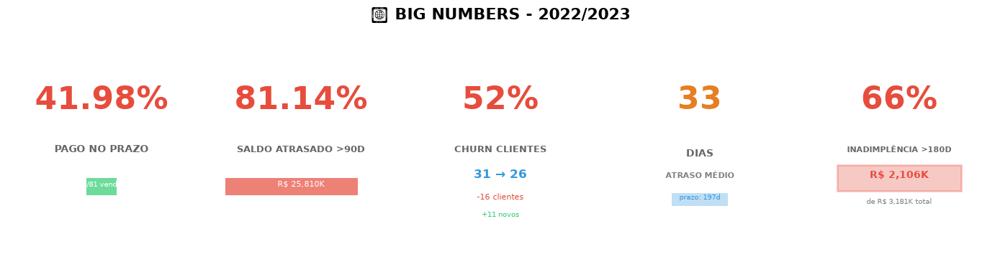

# Análise de Vendas 2022-2023

## Resumo 

### Principais Métricas

- **41,98%** das vendas foram pagas no prazo
- **81,14%** do saldo em aberto está atrasado há mais de 90 dias
- **52%** de churn de clientes (31 → 26)
- **33 dias** de atraso médio (vs prazo de 197 dias)
- **66%** de inadimplência (>180 dias)
